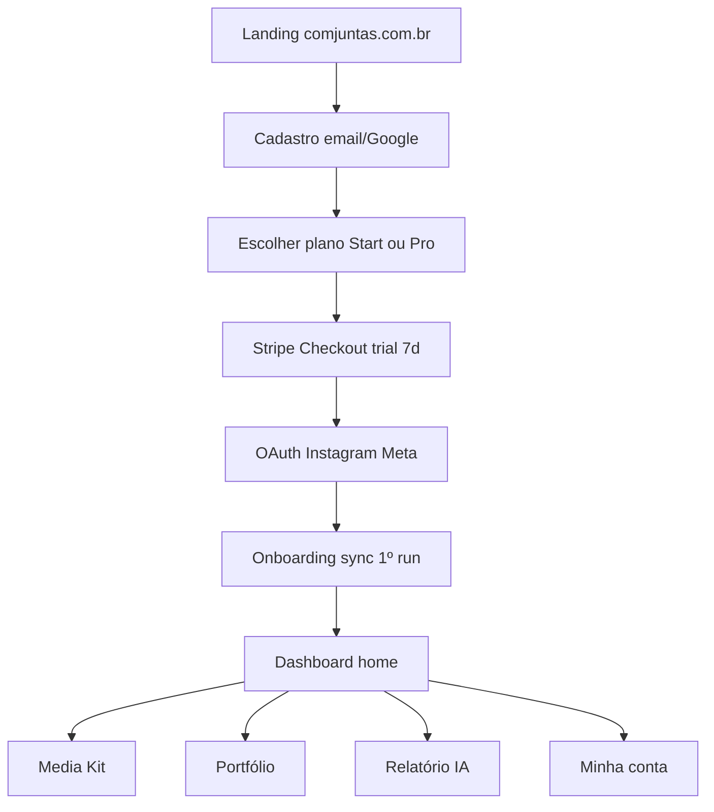

# Front — telas e wireframes F1 (DEC-07)

> **Status:** wireframes F1 ✅ · 2026-08-20  
> **App:** `app.comjuntas.com.br` · **Admin:** `admin.comjuntas.com.br`  
> **Planos:** [`PLANOS-LAUNCH.md`](../produto/PLANOS-LAUNCH.md) · **Stripe:** [`PAYMENT-GATEWAY.md`](PAYMENT-GATEWAY.md)

---

## Superfícies

| URL | Público | F1 |
|-----|---------|-----|
| `comjuntas.com.br` | Marketing (landing, preços) | 1 página mínima |
| `app.comjuntas.com.br` | Usuária creator | Core completo |
| `admin.comjuntas.com.br` | Taty / suporte | Lista + detalhe |

---

## Fluxo principal (F1)



**Regra:** trial começa a contar após **1º sync OK** (além do Stripe trial — ver [`TRIAL-POLICY.md`](../produto/TRIAL-POLICY.md)).

---

## App — navegação (shell)

```
┌─────────────────────────────────────────────────────────────┐
│ [Logo ComJuntas]              @handle    [Trial: 5d] [Avatar]│
├──────────┬──────────────────────────────────────────────────┤
│ Home     │                                                  │
│ Media Kit│              CONTEÚDO DA TELA                     │
│ Portfólio│                                                  │
│ IA       │                                                  │
│ Conta    │                                                  │
└──────────┴──────────────────────────────────────────────────┘
```

Mobile: bottom tab — Home · Kit · Portfólio · IA · Conta

**Banner trial (se `trialing`):**  
*Trial Pro · 5 dias · Assine para manter PDF e portfólio público · [Ver planos]*

---

## 1. Onboarding (5 passos)

### 1.1 Cadastro

```
┌─────────────────────────────────────┐
│         ComJuntas                   │
│   Comunidade de creators beauty     │
│                                     │
│  [ Continuar com Google ]           │
│  [ Continuar com e-mail ]           │
│                                     │
│  Já tem conta? Entrar               │
└─────────────────────────────────────┘
```

**Campos e-mail:** nome · e-mail · senha

---

### 1.2 Escolher plano

```
┌─────────────────────────────────────────────────────────────┐
│  Escolha seu plano · 7 dias grátis                          │
├──────────────────────┬──────────────────────────────────────┤
│  START  R$ 69/mês    │  PRO  R$ 129/mês  ★ RECOMENDADO     │
│  Media kit mensal    │  Kit + portfólio luxe + IA           │
│  Portfólio básico    │  + comunidade + cursos (em breve)    │
│  Sync 1×/semana      │  Sync diário                         │
│  [ Escolher Start ]  │  [ Escolher Pro ]                    │
└──────────────────────┴──────────────────────────────────────┘
  Cartão obrigatório · cancele antes do dia 7 · sem cobrança
```

**CTA default:** Pro pré-selecionado visualmente.

---

### 1.3 Stripe Checkout *(hosted — sai do app)*

Redirect → Stripe Checkout (`mode: subscription`, `trial_period_days: 7`)

**Success URL:** `app.comjuntas.com.br/onboarding/instagram?session_id={CHECKOUT_SESSION_ID}`  
**Cancel URL:** `app.comjuntas.com.br/onboarding/plan`

---

### 1.4 Conectar Instagram

```
┌─────────────────────────────────────┐
│  Conecte seu Instagram              │
│                                     │
│  Usamos a API oficial da Meta.      │
│  Não pedimos sua senha.             │
│                                     │
│  [ Conectar com Instagram ]         │
│                                     │
│  Requisitos:                        │
│  · Conta Creator ou Business        │
│  · Página Facebook vinculada        │
└─────────────────────────────────────┘
```

OAuth Meta → callback → salvar token → redirect passo 1.5

**Erro comum:** não é testador do app → link para doc / suporte.

---

### 1.5 Primeiro sync

```
┌─────────────────────────────────────┐
│  Sincronizando @tatyzacharias…     │
│                                     │
│  ████████░░░░  60%                  │
│                                     │
│  · Perfil                           │
│  · Posts recentes                   │
│  · Insights                         │
│                                     │
│  ⏱ Trial iniciado — 7 dias          │
└─────────────────────────────────────┘
```

**Sucesso:** toast + redirect **Dashboard**  
**Falha:** retry + botão suporte

---

## 2. Dashboard (Home)

```
┌─────────────────────────────────────────────────────────────┐
│  Olá, Tatiana 👋                                             │
│  @tatyzacharias · Plano Pro · Trial 5d                      │
├─────────────────────────────────────────────────────────────┤
│  ┌─────────┐ ┌─────────┐ ┌─────────┐ ┌─────────┐           │
│  │ 32.6k   │ │ 834     │ │ 889     │ │ 1.0k    │           │
│  │ Seguid. │ │ Posts   │ │ Alcance │ │ Views   │           │
│  └─────────┘ └─────────┘ └─────────┘ └─────────┘           │
│  Atualizado há 2h · [ Sincronizar agora ]                   │
├─────────────────────────────────────────────────────────────┤
│  Ações rápidas                                              │
│  [ Gerar media kit ]  [ Ver portfólio ]  [ Relatório IA ]   │
├─────────────────────────────────────────────────────────────┤
│  Status dos entregáveis                                     │
│  ✅ Media kit — gerado 12/08   [ Baixar PDF ] [ Link ]     │
│  ✅ Portfólio — publicado        [ Abrir ] [ Copiar link ]  │
│  ⬜ IA — gerar primeiro relatório  [ Gerar ]                │
├─────────────────────────────────────────────────────────────┤
│  Comunidade & cursos — em breve no Pro 🔔                   │
│  [ Entrar na lista de espera ]                              │
└─────────────────────────────────────────────────────────────┘
```

**Start vs Pro:** Start não mostra link portfólio público luxe; IA bloqueada com upsell.

---

## 3. Media Kit

```
┌─────────────────────────────────────────────────────────────┐
│  Media Kit                                                  │
├─────────────────────────────────────────────────────────────┤
│  Preview (iframe ou thumb PDF)                              │
│  ┌─────────────────────────────────────────────────────┐   │
│  │  [preview glow layout — readonly]                    │   │
│  └─────────────────────────────────────────────────────┘   │
│                                                             │
│  Última geração: 19/08/2026 14:32                           │
│  Sync usado: 19/08/2026                                     │
│                                                             │
│  [ Regenerar kit ]  [ Baixar PDF ]  [ Copiar link público ] │
│                                                             │
│  ── Trial Start ──                                          │
│  ⚠ Preview only · Assine para baixar PDF final              │
└─────────────────────────────────────────────────────────────┘
```

**Estados:** vazio (CTA gerar) · gerando (spinner) · pronto · erro sync

**Pro:** fair use 5 regen/mês — contador visível.

---

## 4. Portfólio

```
┌─────────────────────────────────────────────────────────────┐
│  Portfólio                                                  │
├─────────────────────────────────────────────────────────────┤
│  Link público: comjuntas.app/taty-zacharias  [ Copiar ]     │
│  [ Abrir em nova aba ]                                      │
├─────────────────────────────────────────────────────────────┤
│  Template: Luxe (aprovado) · 84 peças                       │
│                                                             │
│  [ Rebuild portfólio ]                                      │
│                                                             │
│  Curadoria (F1 mínimo):                                     │
│  · Excluir peça do portfólio [ buscar post ]                 │
│  · (F1+) upload capa manual — backlog                       │
├─────────────────────────────────────────────────────────────┤
│  Start: slug comjuntas.app/u/{id} · template básico         │
│  Pro: slug custom · luxe · badge trial se aplicável         │
└─────────────────────────────────────────────────────────────┘
```

---

## 5. Relatório IA

```
┌─────────────────────────────────────────────────────────────┐
│  Relatório IA                                               │
├─────────────────────────────────────────────────────────────┤
│  Gerado em 19/08/2026 · baseado no sync de 19/08            │
│                                                             │
│  ✅ O que está bom                                          │
│  · Nicho beauty claro no nome de exibição                   │
│  · Consistência Reels últimos 30 dias                       │
│                                                             │
│  🔧 O que melhorar                                          │
│  · Bio linha 3 — CTA parcerias                              │
│  · Horários: ter/qui 18h performam melhor                   │
│                                                             │
│  💼 Para marcas                                             │
│  · Destaque: L'Oréal Star, parcerias capilares              │
│                                                             │
│  [ Regenerar relatório ]     Próximo disponível: 01/09      │
├─────────────────────────────────────────────────────────────┤
│  Trial Pro: resumo 3 bullets only · [ Assinar Pro full ]    │
│  Start: 🔒 Disponível no Pro — [ Upgrade ]                    │
└─────────────────────────────────────────────────────────────┘
```

---

## 6. Minha conta / Billing

```
┌─────────────────────────────────────────────────────────────┐
│  Minha conta                                                │
├─────────────────────────────────────────────────────────────┤
│  Perfil                                                     │
│  Nome · E-mail · [ Alterar senha ]                          │
├─────────────────────────────────────────────────────────────┤
│  Plano atual: PRO · Trial (5 dias restantes)                  │
│  Renova em: 27/08/2026 · R$ 129/mês                         │
│                                                             │
│  [ Gerenciar assinatura ]  → Stripe Customer Portal         │
│  [ Upgrade Start → Pro ]                                    │
├─────────────────────────────────────────────────────────────┤
│  Instagram conectado: @tatyzacharias                        │
│  [ Reconectar ] [ Desconectar ]                             │
├─────────────────────────────────────────────────────────────┤
│  Privacidade · Termos · Excluir conta                       │
└─────────────────────────────────────────────────────────────┘
```

**Stripe Portal:** cancelar · trocar cartão · ver faturas.

---

## Admin — 7. Lista de usuárias

```
┌─────────────────────────────────────────────────────────────┐
│  ComJuntas Admin · Tatiana                                  │
├─────────────────────────────────────────────────────────────┤
│  Resumo: 12 ativas · 3 trial · MRR ~R$ 1.4k (est.)          │
├─────────────────────────────────────────────────────────────┤
│  [ Buscar e-mail ou @ ]  Filtro: [Todos▾] [Trial] [Pro]     │
├──────┬──────────────┬────────┬─────────┬──────────┬─────────┤
│ Nome │ @ Instagram  │ Plano  │ Status  │ Sync     │ Ações   │
├──────┼──────────────┼────────┼─────────┼──────────┼─────────┤
│ Rafa │ @rafa.beauty │ Pro    │ trial   │ há 1d    │ [ Ver ] │
│ Ana  │ @ana.ugc     │ Start  │ active  │ há 3h    │ [ Ver ] │
│ …    │              │        │         │          │         │
└──────┴──────────────┴────────┴─────────┴──────────┴─────────┘
```

**Auth admin:** e-mail allowlist (Taty) + role `admin`.

---

## Admin — 8. Detalhe da usuária

```
┌─────────────────────────────────────────────────────────────┐
│  ← Voltar    Rafa Silva · rafa@email.com                    │
├─────────────────────────────────────────────────────────────┤
│  Plano: Pro · trialing · Stripe cus_xxx                     │
│  IG: @rafa.beauty · token expira 12/09                      │
│  Cadastro: 15/08/2026 · Trial sync iniciado: 16/08         │
├─────────────────────────────────────────────────────────────┤
│  Ações suporte                                              │
│  [ Forçar sync ] [ Regenerar kit ] [ Regenerar portfólio ]  │
│  [ Ver relatório IA ] [ Abrir Stripe customer ]             │
├─────────────────────────────────────────────────────────────┤
│  Entregáveis                                                │
│  Media kit: ✅ 16/08 — link                               │
│  Portfólio: ✅ 12 peças (trial)                             │
│  IA: resumo trial gerado 17/08                             │
├─────────────────────────────────────────────────────────────┤
│  Log recente                                                │
│  19/08 14:02 sync ok · 19/08 14:05 kit built · …            │
└─────────────────────────────────────────────────────────────┘
```

---

## Landing mínima (marketing F1)

```
Hero: ComJuntas — creators beauty crescendo juntas
[ Começar trial 7 dias ] → app/onboarding/signup

3 bullets: Media kit · Portfólio · IA
Pricing: Start R$69 · Pro R$129 ★
Footer: by Tatiana Zacharias · @comjuntas
```

---

## Rotas Next.js (rascunho)

| Rota | Tela |
|------|------|
| `/login` | Cadastro / login |
| `/onboarding/plan` | Escolher plano |
| `/onboarding/instagram` | OAuth IG |
| `/onboarding/sync` | 1º sync |
| `/` | Dashboard |
| `/media-kit` | Media Kit |
| `/portfolio` | Portfólio |
| `/insights` | Relatório IA |
| `/account` | Minha conta |
| `/admin/users` | Lista admin |
| `/admin/users/[id]` | Detalhe admin |

---

## Fora do F1 (placeholder UI)

| Tela | Fase | Placeholder no app |
|------|------|-------------------|
| Meus cursos | F2 | card “Em breve” + waitlist |
| Comunidade / fila | F3 | idem |
| Aprovar engajamento | F4 | idem |

---

## Checklist DEC-07

- [x] Onboarding (plano → Stripe → IG → sync)
- [x] Dashboard
- [x] Media kit
- [x] Portfólio
- [x] Relatório IA
- [x] Minha conta / billing
- [x] Admin lista
- [x] Admin detalhe

*(Figma opcional depois — este doc é fonte para F0/F1.)*
